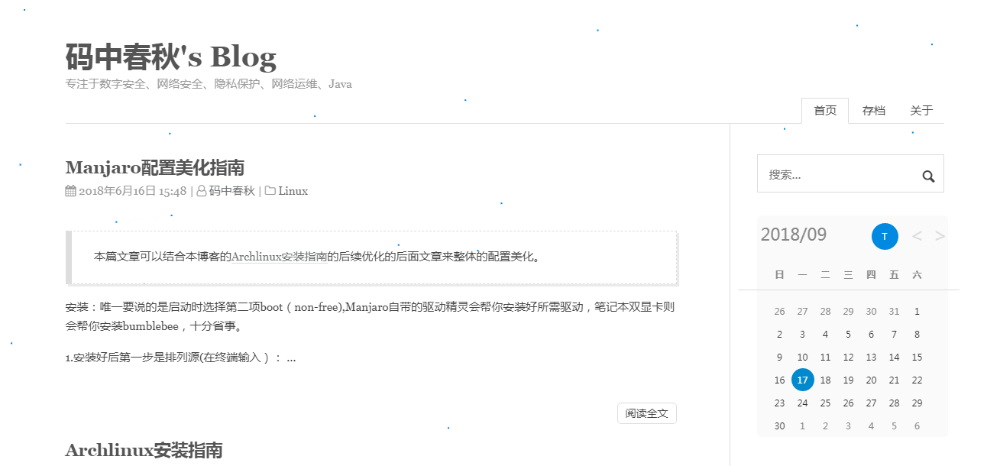

# Maupassant
Maupassant theme, ported to Hugo.

1. Preview: [码中春秋's Blog](https://blog.inofd.com/)
2. [中文文档](README_Zh.md)

A simple Hugo template with great performance on different devices, ported from a Typecho theme by [Cho](https://github.com/pagecho/maupassant/), forked and modified from [飞雪无情的博客](https://github.com/rujews/maupassant-hugoo).

## Preview



## Features

## Installation

```bash
cd <YOUR Bolg Root Dir>
git clone https://github.com/udpsec/maupassant-hugo-v2.git themes/maupassant
```

## Configuration

#### Apply theme

```toml
theme = "maupassant"
```

#### Basic Configuration

```toml
baseURL = "https://blog.inofd.com"
languageCode = "zh-CN"
title = "码中春秋's Blog"
theme = "maupassant"

[author]
  name = "码中春秋"

[params]
  author = "码中春秋"
  subtitle = "专注于数字安全、网络安全、隐私保护、网络运维、Java"
  keywords = "码中春秋,博客,,inofd,java,python,项目管理,软件架构,网络安全,数字安全,隐私保护"
  description = "专注于IT互联网和数字安全，包括但不限于Java、Python、数字安全隐私保护等"
```

#### Menus

```toml
[menu]
  [[menu.main]]
    identifier = "archives"
    name = "存档"
    url = "/archives/"
    weight = 2
  [[menu.main]]
    identifier = "about"
    name = "关于"
    url = "/about/"
    weight = 3
```

#### friend links

```toml
[[params.links]]
  title = "码中春秋"
  name = "码中春秋"
  url = "https://blog.inofd.com/"
```

#### Google Analytics

```toml
googleAnalytics = "GA ID"
```

#### Disqus

```toml
disqusShortname = "yourdiscussshortname"
```

#### Page View Support

```toml
[params]
  busuanzi = true
```

**Gitalk**

```
---
gitalk: true
---
```

**config.toml**

```
[params]
clientID=''
clientSecret=''
owner=''
repo=''
admin=''
```

**TOC**

```
---
TableOfContents: true
---
```

**Article link Static**

```
#Similarly, in the new article, add the date url after the date of writing the new generated article, and write the English of the article.

url: /2018/06/16/manjaro-installer-beautify-config.html
```

## Contributing

All kinds of contributions (enhancements, new features, documentation & code improvements, issues & bugs reporting) are welcome.

Looking forward to your pull request.

## Maupassant on other platforms

+ Typecho：https://github.com/pagecho/maupassant/
+ Octopress：https://github.com/pagecho/mewpassant/
+ Farbox：https://github.com/pagecho/Maupassant-farbox/
+ Wordpress：https://github.com/iMuFeng/maupassant/
+ Ghost: https://github.com/LjxPrime/maupassant/
+ Hexo: https://github.com/tufu9441/maupassant-hexo
+ Hugo: https://github.com/rujews/maupassant-hugo
